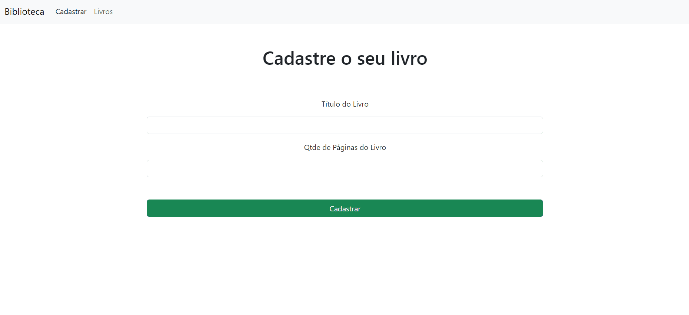

# Projeto Biblioteca - Node.js, Express, MySQL e Handlebars

Bem-vindo ao Projeto Biblioteca, uma aplicação desenvolvida para aprimorar habilidades em Node.js, utilizando Express como framework web, MySQL como banco de dados relacional e Handlebars como view engine. Este projeto permite o gerenciamento de livros com operações básicas de CRUD (Create, Read, Update, Delete). Além disso, o layout responsivo foi construído com Bootstrap, proporcionando uma experiência amigável em dispositivos de diferentes tamanhos.

## Funcionalidades

- **Cadastro de Livros:** Os usuários podem cadastrar livros, fornecendo informações como título e quantidade de páginas.
- **Listagem de Livros:** Visualize todos os livros cadastrados.
- **Atualização de Informações:** Modifique os dados de um livro existente.
- **Exclusão de Livros:** Remova livros da biblioteca.

## Tecnologias Utilizadas

- **Node.js:** Plataforma server-side para execução de JavaScript.
- **Express:** Framework web para facilitar o desenvolvimento de aplicações web em Node.js.
- **MySQL:** Banco de dados relacional para armazenar informações sobre os livros.
- **Handlebars:** View engine para simplificar a renderização de páginas HTML.
- **Bootstrap:** Framework CSS para criação de um layout responsivo e estilizado.
- **Nodemon:** Ferramenta que monitora alterações no código e reinicia automaticamente o servidor, facilitando o desenvolvimento.

## Pré-requisitos

- Node.js instalado
- MySQL instalado e configurado
- NPM (Node Package Manager) instalado

## Como Executar o Projeto

1. Clone o repositório: `https://github.com/AlexMoralesDEV/ProjetoBiblioteca.git`
2. Acesse o diretório do projeto: `cd ProjetoBiblioteca`
3. Instale as dependências: `npm install`
4. Inicie o servidor usando Nodemon: `npm start`
5. Abra o navegador e acesse `http://localhost:3000` para interagir com a aplicação.

## Contribuição

Contribuições são bem-vindas! Sinta-se à vontade para abrir issues, propor melhorias ou enviar pull requests. Aproveite a experiência de desenvolvimento e continue aprimorando suas habilidades em Node.js, Express e Handlebars! #NodeJS #ExpressJS #MySQL #Handlebars #Bootstrap #CRUD